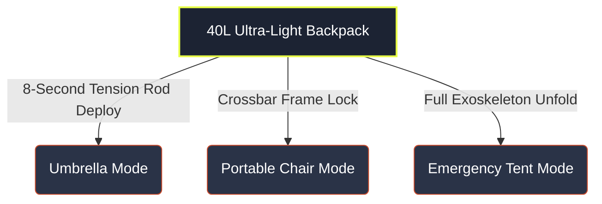

```python
# Generate the requested README.md content and save it to a file
readme_content = """# 🎒 Transformers Gadget — Carry Less. Do More.

Welcome to the repository for **Transformers Gadget**, a futuristic landing page developed for an **English Debating Class "Shark Tank" pitch session**. 

This repository hosts a high-fidelity front-end prototype designed to pitch a disruptive consumer product: a high-end, modular, engineering-forward backpack that transforms into an umbrella, a portable seat, or a 3-season emergency tent in under 30 seconds.

---

## 🦈 The Shark Tank Pitch Concept

In modern commuting and outdoor adventures, consumers face a constant dilemma: pack heavy to prepare for all conditions, or travel light and risk getting caught in the elements. **Transformers Gadget** solves this by embedding an aerospace-grade mechanical exoskeleton directly into a 40L waterproof daily pack.

### 🔄 The Product Transformation Loop

```

```text
README.md generated successfully.



---

## ✨ Website Design & UI Features

The website is a clean, single-page interactive landing page crafted with a **sleek, ultra-modern tech aesthetic** to match the premium nature of the pitched product.

* **Dark Cyberpunk Aesthetic:** Built using a modern technical palette — Deep Onyx (`#080a0f`), Off-White (`#f0ede8`), Neon Lime (`#e8ff47`) highlights, and Rust (`#c94a2b`) indicators.
* **Custom Micro-Interactions:** * A custom floating cursor system with a dynamic tracking ring that reacts to links using custom blend-mode properties.
* An infinitely looping horizontal CSS marquee track showcasing technical specifications.


* **Inline Product Vector Art:** Features an inline, responsive SVG graphic representing the product structure and transforming accessories without relying on heavy external images.
* **Fully Responsive Framework:** Built natively using fluid CSS Grids and layout structures that stack smoothly on mobile devices and viewports under 900px.

---

## 🛠️ Technical Implementation

* **HTML5:** Semantic architecture layout (`<nav>`, `<section>`, `<svg>`).
* **Pure CSS3:** Natively structured variables (`:root`) for easy design tokens management, linear/radial masking layers, procedural SVG grain overlays, and custom keyframe animations (`fadeUp`, `scaleIn`, `marquee`, `float`).
* **Typography:** Web integration of geometric fonts (*Syne* for heavy headliners, *DM Mono* for code-like metric specifications).

---

## 🚀 Getting Started

Since this landing page is built strictly using vanilla front-end code, it has **zero package dependencies** and requires no compilation.

1. Clone or download this repository.
2. Open `index.html` directly in any modern web browser (Chrome, Safari, Edge, or Firefox).
3. Ensure you have an internet connection active to allow Google Fonts (*Syne* and *DM Mono*) to load.

---

## 👥 Project Context (English Class)

This website functioned as the primary interactive visual anchor during a graded English Debating and Public Speaking module focused on Entrepreneurship.

> 🎯 **Pitch Objective:** Defend market viability, handle high-pressure cross-examinations from classmate "Sharks," and communicate an engineering-heavy device layout clearly using advanced public speaking structures.
> """

with open("README.md", "w", encoding="utf-8") as f:
f.write(readme_content)

print("README.md generated successfully.")

```
Your markdown file is ready
[file-tag: code-generated-file-0-1780606425787563229]

```markdown
# 🎒 Transformers Gadget — Carry Less. Do More.

Welcome to the repository for **Transformers Gadget**, a futuristic landing page developed for an **English Debating Class "Shark Tank" pitch session**. 

This repository hosts a high-fidelity front-end prototype designed to pitch a disruptive consumer product: a high-end, modular, engineering-forward backpack that transforms into an umbrella, a portable seat, or a 3-season emergency tent in under 30 seconds.

---

## 🦈 The Shark Tank Pitch Concept

In modern commuting and outdoor adventures, consumers face a constant dilemma: pack heavy to prepare for all conditions, or travel light and risk getting caught in the elements. **Transformers Gadget** solves this by embedding an aerospace-grade mechanical exoskeleton directly into a 40L waterproof daily pack.

### 🔄 The Product Transformation Loop


---

## ✨ Website Design & UI Features

The website is a clean, single-page interactive landing page crafted with a **sleek, ultra-modern tech aesthetic** to match the premium nature of the pitched product.

* **Dark Cyberpunk Aesthetic:** Built using a modern technical palette — Deep Onyx (`#080a0f`), Off-White (`#f0ede8`), Neon Lime (`#e8ff47`) highlights, and Rust (`#c94a2b`) indicators.
* **Custom Micro-Interactions:** * A custom floating cursor system with a dynamic tracking ring that reacts to links using custom blend-mode properties.
* An infinitely looping horizontal CSS marquee track showcasing technical specifications.


* **Inline Product Vector Art:** Features an inline, responsive SVG graphic representing the product structure and transforming accessories without relying on heavy external images.
* **Fully Responsive Framework:** Built natively using fluid CSS Grids and layout structures that stack smoothly on mobile devices and viewports under 900px.

---

## 🛠️ Technical Implementation

* **HTML5:** Semantic architecture layout (`<nav>`, `<section>`, `<svg>`).
* **Pure CSS3:** Natively structured variables (`:root`) for easy design tokens management, linear/radial masking layers, procedural SVG grain overlays, and custom keyframe animations (`fadeUp`, `scaleIn`, `marquee`, `float`).
* **Typography:** Web integration of geometric fonts (*Syne* for heavy headliners, *DM Mono* for code-like metric specifications).

---

## 🚀 Getting Started

Since this landing page is built strictly using vanilla front-end code, it has **zero package dependencies** and requires no compilation.

1. Clone or download this repository.
2. Open `index.html` directly in any modern web browser (Chrome, Safari, Edge, or Firefox).
3. Ensure you have an internet connection active to allow Google Fonts (*Syne* and *DM Mono*) to load.

---

## 👥 Project Context (English Class)

This website functioned as the primary interactive visual anchor during a graded English Debating and Public Speaking module focused on Entrepreneurship.

> 🎯 **Pitch Objective:** Defend market viability, handle high-pressure cross-examinations from classmate "Sharks," and communicate an engineering-heavy device layout clearly using advanced public speaking structures.

```

```
